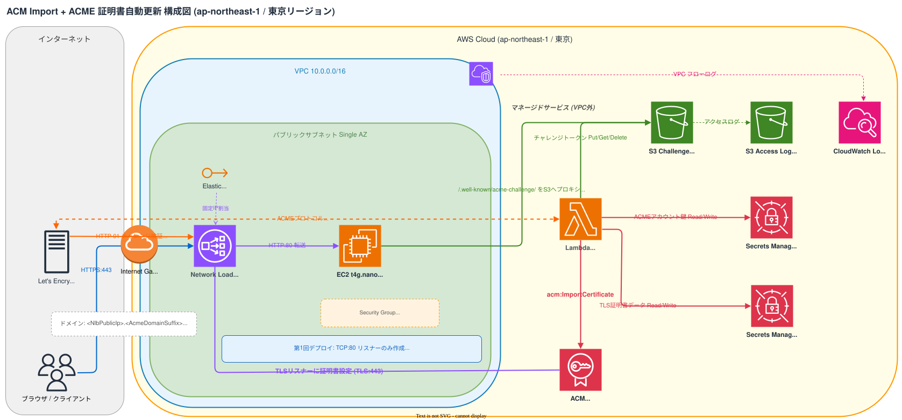

# acm-import-acme-automation

短期間化する証明書有効期間対応のために、ACMEを使った証明書の自動更新を試します。  
本リポジトリは、以下の前提です。

- ACMに外部取得した証明書をインポート
- ACMEクライアントをLambdaで実行してACMに格納した証明書を自動更新

## 構成

```text
インターネット → NLB (TLS終端 / ACM証明書) → EC2 (HTTP / nginx)
```



- NLBはEIPを持つインターネット向け構成
- Lambda(ACMEクライアント)がHTTP-01で証明書を取得してACMへインポート
- EC2 nginxは `/.well-known/acme-challenge/` をS3にプロキシ
- 証明書対象ドメインは `<NlbPublicIp>.<AcmeDomainSuffix>`
- NLBターゲットグループのヘルスチェックは `HTTP /healthz` を使用

| リソース | 内容 |
| --- | --- |
| VPC | シングルAZ、パブリックサブネットのみ(NAT GWなし) |
| EC2 (t4g.nano) | ARM64 / Amazon Linux 2023 / nginx(HTTP:80) |
| NLB | インターネット向け / EIPで固定IPを割り当て |
| EIP | NLBに割り当てる静的IPアドレス |
| ACM | NLBのTLSリスナーに設定するTLS証明書を格納 |
| Lambda(Python 3.12) | ACMEプロトコル(Let's Encrypt)で証明書を取得・更新 |
| Secrets Manager | ACMEアカウントキーおよびTLS証明書データを保管 |
| S3 | ACME HTTP-01チャレンジトークンの一時保管 |

## 前提条件

- AWS CLIおよびCDK CLIがインストール済みであること
- `aws login` 等で東京リージョン( `ap-northeast-1` )でAWS CLIが使用可能な状態であること
- Node.js 18以上がインストール済みであること

## セットアップ

```bash
npm install
npx cdk bootstrap
npm run build
```

## デプロイ手順

デプロイは2回に分けて実施します。

### CDKパラメータ

| パラメータ | 用途 | 既定値 |
| --- | --- | --- |
| `AcmeDomainSuffix` | 証明書対象FQDNのドメインサフィックス | `nip.io` |
| `AcmeDirectoryUrl` | ACMEディレクトリURL | `https://acme-staging-v02.api.letsencrypt.org/directory` |
| `CertificateArn` | NLB TLSリスナーに設定するACM証明書ARN(2回目デプロイで使用) | 空文字 |

### 第1回デプロイ（インフラ構築）

このデプロイではNLB(TCP:80 リスナーのみ)とEC2などのインフラを構築します。  
`AcmeDomainSuffix` はデフォルトで `nip.io` です。  
`AcmeDirectoryUrl` は既定でLet’s Encrypt stagingを使用します(検証向け)。

```bash
npx cdk synth
npx cdk deploy --require-approval never
```

デプロイ後、CloudFormation出力 `NlbAcmeFqdn` が証明書対象FQDNです。

### Lambda手動実行（証明書取得・ACMインポート）

```bash
# Lambda関数名を取得
LAMBDA_ARN=$(aws cloudformation describe-stacks \
  --stack-name AcmImportAcmeStack \
  --region ap-northeast-1 \
  --query "Stacks[0].Outputs[?OutputKey=='RenewCertLambdaArn'].OutputValue" \
  --output text)

# Lambda を手動実行
aws lambda invoke \
  --function-name "$LAMBDA_ARN" \
  --region ap-northeast-1 \
  --payload '{}' \
  response.json

jq -r '.body | fromjson' response.json
```

実行結果の `certificateArn` フィールドにACM証明書のARNが記録されます。  
次のデプロイで使用します。

> `Timeout during connect` が出る場合は、[トラブルシュート](#トラブルシュート)を参照してください。

### 第2回デプロイ（NLB TLSリスナー有効化）

第1回デプロイで取得したACM証明書ARNを `CertificateArn` パラメータに指定して再デプロイします。  
これによりNLBにTLS:443リスナーが追加され、エンドツーエンドのHTTPS通信が有効になります。

```bash
npx cdk deploy --require-approval never \
  --parameters CertificateArn=$(jq -r '.body | fromjson | .certificateArn' response.json)
```

## 証明書の更新

証明書の有効期限が近づいたら、Lambdaを手動実行することで更新できます。  
`CERTIFICATE_ARN` が設定されていれば既存のACM証明書が上書き更新され、NLBへの再設定は不要です。

```bash
# Lambda関数名を取得
LAMBDA_ARN=$(aws cloudformation describe-stacks \
  --stack-name AcmImportAcmeStack \
  --region ap-northeast-1 \
  --query "Stacks[0].Outputs[?OutputKey=='RenewCertLambdaArn'].OutputValue" \
  --output text)

# Lambda を手動実行
aws lambda invoke \
  --function-name "$LAMBDA_ARN" \
  --region ap-northeast-1 \
  --payload '{}' \
  response.json
```

## staging / production の切替

### 既定（staging）

既定値:

```text
https://acme-staging-v02.api.letsencrypt.org/directory
```

Let's Encryptのレート制限を避けるため、初回はステージング環境で動作確認することを推奨します。

> staging証明書はブラウザに信頼されません。動作確認用途として使用してください。

### production へ切替する場合

本番証明書を発行する場合のみ、`AcmeDirectoryUrl` をproduction URLに変更してデプロイします。

```bash
npx cdk deploy --require-approval never \
  --parameters AcmeDirectoryUrl=https://acme-v02.api.letsencrypt.org/directory
```

## Lambda環境変数

Lambda関数( `RenewCertLambda` )の環境変数はCDKスタック定義から自動的に設定されます。  
手動で変更する場合はAWSマネジメントコンソールのLambda設定画面、またはAWS CLIで更新してください。

| 環境変数 | 設定方法 | 説明 |
| --- | --- | --- |
| `ACME_DIRECTORY_URL` | CDKパラメータ | Let's Encrypt ACME URL |
| `ACME_ACCOUNT_SECRET_ARN` | CDK自動設定 | ACMEアカウント秘密鍵シークレットARN |
| `CERT_SECRET_ARN` | CDK自動設定 | 証明書データシークレットARN |
| `CHALLENGE_BUCKET` | CDK自動設定 | HTTP-01 トークン保存S3バケット |
| `DOMAIN` | CDK自動設定 | `<NlbPublicIp>.<AcmeDomainSuffix>` |
| `CERTIFICATE_ARN` | CDKパラメータ | 再インポート時に既存証明書ARNを指定 |

## トラブルシュート

### `too many certificates ... for "<dynamic-dns-domain>"`

Let's Encryptの登録ドメイン単位レート制限です。

対処:

- stagingを使う(本リポジトリの既定)
- `AcmeDomainSuffix` を別の動的DNSサフィックスへ変更
- 本番運用時は独自ドメインを使用

### NLB ヘルスチェックが `unhealthy`

第1回デプロイ後にターゲットが `unhealthy` の場合は、以下を確認してください。

1. **EC2でnginxが起動しているか**

   ```bash
   INSTANCE_ID=$(aws cloudformation describe-stack-resources \
     --stack-name AcmImportAcmeStack \
     --region ap-northeast-1 \
     --query "StackResources[?LogicalResourceId=='WebServer'].PhysicalResourceId" \
     --output text)

   aws ssm start-session --target "$INSTANCE_ID" --region ap-northeast-1

   # EC2セッション内で実行
   sudo systemctl status nginx
   sudo nginx -t
   ```

2. **ヘルスチェックパスが応答するか**

   ```bash
   # EC2セッション内で実行
   curl -sS -o /dev/null -w "%{http_code}\n" http://127.0.0.1/healthz
   ```

   `200` が返ればヘルスチェックパスは正常です。

### Lambda実行で `No module named '_cffi_backend'` が出る場合

Lambdaの依存ライブラリにネイティブ拡張( `cryptography` / `cffi` )が含まれるため、
ローカル環境で作成した成果物を使うとLambda実行環境(ARM64)と不整合になることがあります。

このリポジトリでは依存関係をARM64向けでバンドルする構成にしているため、
以下を再実行して関数を更新してください。

```bash
npm run build
npx cdk deploy
```

再デプロイ後に再度Lambdaを手動実行し、`FunctionError` が出ないことを確認してください。

### ACME HTTP-01 が `Timeout during connect` / `403 AccessDenied` になる場合

IP証明書の検証で `/.well-known/acme-challenge/*` が失敗する場合、以下を順に確認してください。

- **Lambda の事前到達性チェック結果を確認**
  - 本実装ではchallenge配信後に `http://<DOMAIN>/.well-known/acme-challenge/<token>` へ事前アクセスし、`200 + 本文一致` を確認してからACME応答します。
  - `HTTP-01 precheck failed` が返る場合は、ACME側ではなく到達性(SG/NLB/nginx/S3)を優先して修正してください。

- **NLBのSource IP保持に伴うSecurity Group設定**
  - NLB(instanceターゲット)はクライアントIPを保持してEC2へ転送します。
  - EC2のSecurity Groupで `tcp/80` をクライアント送信元から受けられる設定にしてください。
  - VPC CIDRのみ許可だと、外部からのHTTP-01検証が到達できず `Timeout` になります。

- **nginx の S3プロキシTLS検証設定**
  - `proxy_ssl_verify on;` を使う場合、`proxy_ssl_trusted_certificate` の指定が必要です。
  - 例: `/etc/pki/tls/certs/ca-bundle.crt`
  - 未設定だとnginx起動時に `no proxy_ssl_trusted_certificate for proxy_ssl_verify` で失敗します。

- **S3 challengeプレフィックスの公開読取**
  - `/.well-known/acme-challenge/*` をS3へ `proxy_pass` する場合、Let's Encryptからの取得は匿名アクセスになります。
  - バケット全体ではなく、`/.well-known/acme-challenge/*` のみ `s3:GetObject` を許可してください。
  - 未設定だと `403 AccessDenied` になります。

HTTP到達性の確認コマンド:

```bash
NLB_PUBLIC_IP=$(aws cloudformation describe-stacks \
  --stack-name AcmImportAcmeStack \
  --region ap-northeast-1 \
  --query "Stacks[0].Outputs[?OutputKey=='NlbPublicIp'].OutputValue" \
  --output text)

CHALLENGE_BUCKET=$(aws cloudformation describe-stacks \
  --stack-name AcmImportAcmeStack \
  --region ap-northeast-1 \
  --query "Stacks[0].Outputs[?OutputKey=='ChallengeBucketName'].OutputValue" \
  --output text)

TOKEN="preflight-$(date +%s)"
aws s3 cp <(printf 'ok') "s3://${CHALLENGE_BUCKET}/.well-known/acme-challenge/${TOKEN}" --region ap-northeast-1
curl -sS -D - "http://${NLB_PUBLIC_IP}.nip.io/.well-known/acme-challenge/${TOKEN}"
```

`HTTP/1.1 200` と本文 `ok` が返る状態であれば、HTTP-01の前提を満たしています。

## 検証コマンド

```bash
npm run build
npm run lint
npm test
npx cdk synth
```

## 費用を抑えるための補足

- 現状の `t4g.nano + single-AZ + NATなし` は、要件を満たしつつ安価な構成です。
- さらに抑える場合は、検証後にスタックを削除して従量課金を止める運用が有効です。
